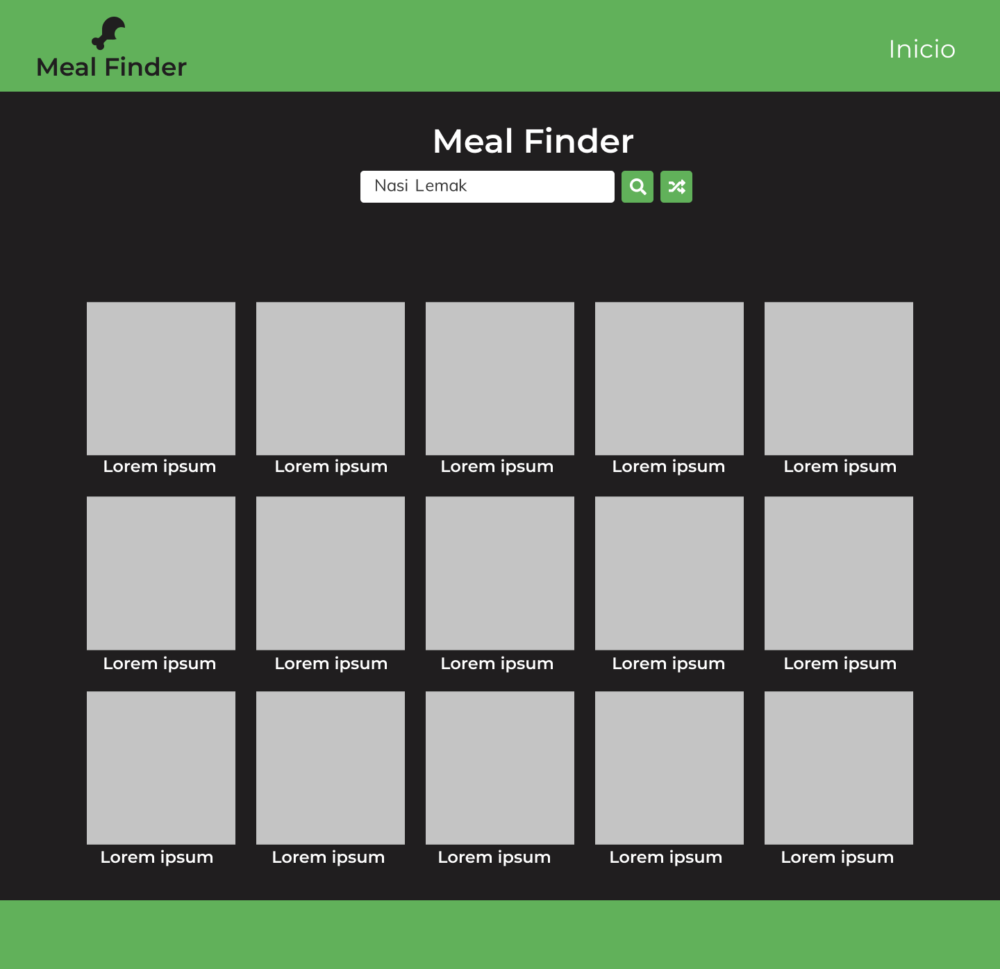
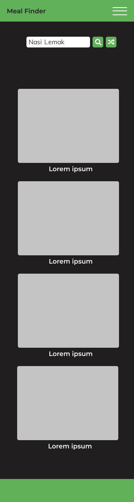
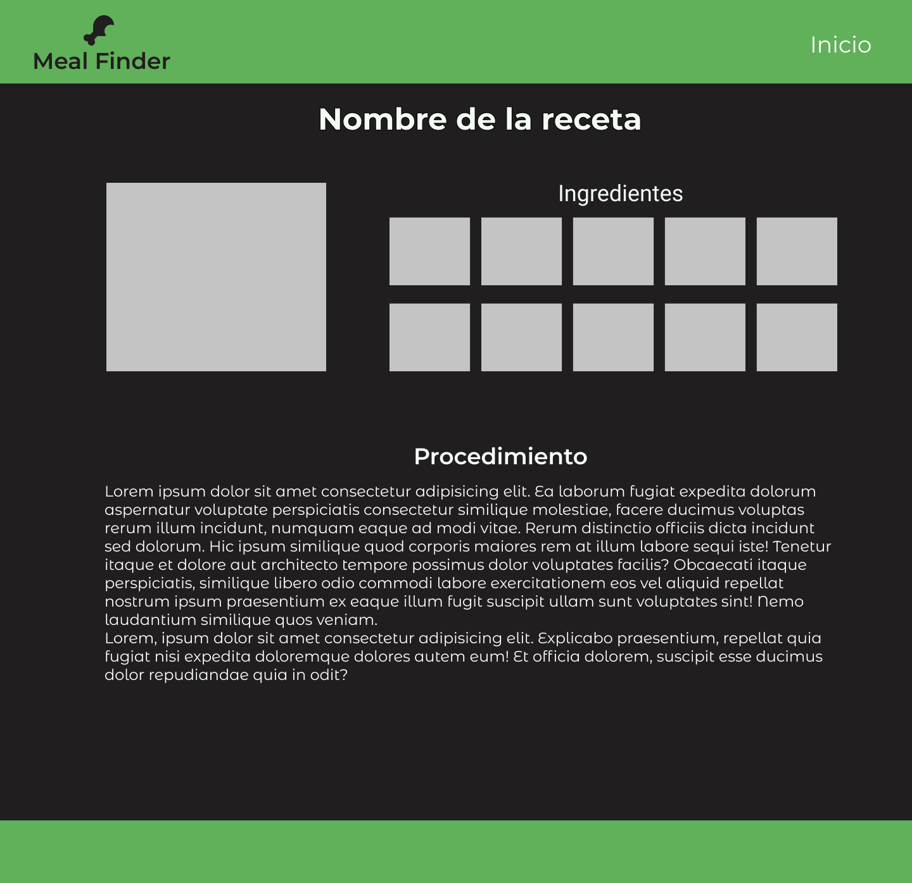
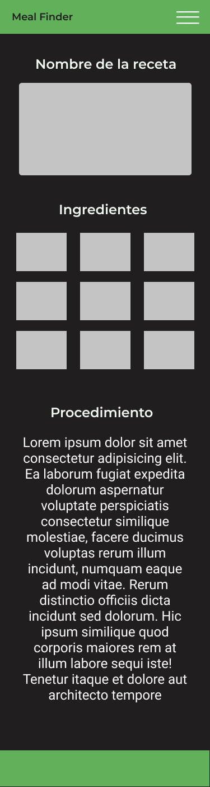

# Buscador de recetas

## Integrantes del equipo 11

- [Maria Fernanda Orozco Castro](https://github.com/Orozcastro)
- [Luis Felipe Carrillo Alvarado](https://github.com/carrillodev)
- [Luis Daniel Ramírez Guerra](https://github.com/DanyGuerra)
- [Victor Alberto Díaz Sánchez](https://github.com/vads26)
- [José Juan Calderón Castillo](https://github.com/josechee)

## Primera parte del proyecto

### Objetivo
Dejar listo el ambiente de desarrollo:

- Desarrolla los mockups de la aplicación, esto te permitirá visualizar cómo se van a acomodar todos los elementos mucho antes de crear el código. Es parte fundamental en el desarrollo del software.

- Instalar y configurar Webpack, Babel y Webpack Dev Server.

- Instalar las librerías que se vayan a utilizar (Bootstrap, Materialize, Foundation, etc.).

- Configurar los loaders necesarios para los estilos, se puede utilizar CSS o SASS.

### Desarrollo

#### Mockup de la aplicación
Se realizaron los Mockups de la aplicación para definir los elementos que conformarán el proyecto. Para realizar los Mockups se utilizó Figma.
[Mockup de la aplicación.](https://www.figma.com/file/dKylA3aZgASL1RnzfiwqLt/Buscador-de-comidas?node-id=80%3A2)

A continuación se muestra el diseño de la pagina:









#### Instalación y configuración de Webpack, Babel y Dev Server.

Para usar webpack se debe inicializar npm ejecutando el comando `npm init -y` estando en la ruta deseada. Esto nos creará el archivo `package.json`

Una vez creado el archivo `package.json` instalamos las librerias con el comando:

```
npm install --save-dev webpack webpack-cli html-webpack-plugin
```

- webpack: libreria de webpack.
- webpack-cli: permite ejecutar webpack en la linea de comandos.
- html-webpack-plugin: ayuda a crear archivos HTML que ejecutan bundles de webpack.

Al mismo nivel del archivo `package.json` se crea un archivo llamado `webpack.config.js`, en el cual se definen las configuraciones de webpack, el punto de entrada y el output.

Archivo [`webpack.config.js`](./webpack.config.js)
```javascript
const path = require('path');
const HtmlWebpackPlugin = require('html-webpack-plugin');

module.exports = {
  entry: './src/js/index.js',
  output: {
    path: path.resolve(__dirname, 'dist'),
    filename: 'bundle.js'
  },
  plugins: [
    new HtmlWebpackPlugin({
      filename: 'index.html',
      template: './src/index.html'
    })
  ]
}
```

Con Webpack Dev Server cada que se hace un cambio en el codigo webpack automaticamente creara un bundle y abrirá nuestra aplicación en el navegador.

Para instalar la librería se ejecuta el comando:

```
npm install --save-dev webpack-dev-server
```

En el archivo [`webpack.config.js`](./webpack.config.js), se agrega la propiedad de `devserver`

```javascript
const path = require('path');
const HtmlWebpackPlugin = require('html-webpack-plugin');

module.exports = {
  entry: './src/js/index.js',
  output: {
    path: path.resolve(__dirname, 'dist'),
    filename: 'bundle.js'
  },
  plugins: [
    new HtmlWebpackPlugin({
      filename: 'index.html',
      template: './src/index.html'
    })
  ],
  devServer: {
    contentBase: path.resolve(__dirname, 'dist')
  }
}
```

Se agregan los siguientes scripts al archivo [`package.json`](./package.json) los cuales se usarán para iniciar webpack devserver.

```javascript
"scripts": {
  "start": "webpack serve --mode development --open",
  "build": "webpack --mode production"
}

```

Ahora se puede ejecutar el comando `npm run start` para iniciar el servidor local con webpack en el cual se visualizan los cambios que se generan en el bundle.

#### Librerías a utilizar

En el desarrollo del proyecto se usará la librería de Bootstrap.


#### Loaders para los estilos

Para los estilos se configuraron los loaders para sass de la siguiente manera.

Para instalar los loaders de css se usa el comando:

```
npm install --save-dev css-loader style-loader
```

Para la instalación de los loaders de sass se utilza el siguiente comando:

```
npm install --save-dev sass-loader
```

Y se edita el archivo [ `webpack.config.js`](./webpack.config.js) de la siguiente manera:

```javascript
const path = require('path');
const HtmlWebpackPlugin = require('html-webpack-plugin');

module.exports = {
  entry: './src/js/index.js',
  output: {
    path: path.resolve(__dirname, 'dist'),
    filename: 'bundle.js'
  },
  plugins: [
    new HtmlWebpackPlugin({
      filename: 'index.html',
      template: './src/index.html'
    })
  ],
  module: {
    rules: [
      { test: /\.css$/, use: ['style-loader', 'css-loader'] },
      {
        test: /\.s[ac]ss$/i,
        use: ['style-loader', 'css-loader', 'sass-loader'],
      },
    ],
  },
  devServer: {
    contentBase: path.resolve(__dirname, 'dist')
  }
}

```

